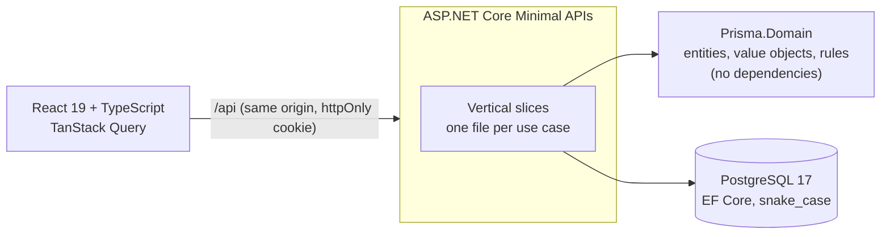

# Prisma

**Personal finance built for how money actually moves in Brazil:** Pix, credit card statements with
real closing and due dates, installments that never lose a cent, and refunds that behave like refunds.

[](https://github.com/vagnerwentz/prisma/actions/workflows/ci.yml)


The CI badge covers the whole pipeline: backend unit, property, integration and architecture tests,
plus frontend lint, unit tests and production build. Deploys only happen when it is green.

## Why

Most finance apps treat a credit card purchase as money spent the day you swipe. In Brazil that is
rarely true: the purchase lands on a statement, the statement closes on a date the bank decides, and
the money leaves your account on the due date, sometimes split into installments. Prisma models that
reality, so the monthly numbers match your bank account instead of your receipts.

## What it does

- **Accounts:** checking, cash, investments and credit cards, with balances.
- **Credit card statements:** each purchase lands on the right statement from the card's closing and
  due days; statement dates can be adjusted when the bank moves them.
- **Aligned with the bank:** a purchase the bank posted to the next statement can be moved there
  (installment purchases move whole), and adjusting a statement's dates shows, before saving, which
  purchases would change statements. Both come with one-tap undo.
- **Wrong card? Change it:** a purchase logged on the wrong card moves to the other card's
  statements (installments move together), with the money leaving on the new due date.
- **Recurring entries:** a weekly or monthly Pix, or a charge a company makes on the card every month.
  Each occurrence is recorded only on its day; what is still to come shows up as a lighter projection in
  the months ahead and on the open statement, never in balances. A charge that would land on an
  already-paid statement waits for a decision instead of changing it.
- **Installments:** R$ 100.00 in 3x is 33.34 + 33.33 + 33.33, always adding up to the total.
- **Refunds** reduce spending in the month they land and are never counted as income.
- **Transfers** (including paying a card statement) are never income or expense, so nothing is
  counted twice.
- **Cash-flow dashboard:** what came in, what went out and what was invested each month, by
  settlement date; category breakdown, month-over-month explanation and upcoming commitments.
- **Categories:** a default set per user that evolves: new default categories reach existing users
  once, without undoing their renames or deletions.
- **Undo everywhere:** deleting is a soft delete, restorable from the toast.

## Engineering highlights

- **Money is an integer.** Amounts are `long` cents behind a `Money` value object; splitting into
  installments distributes the remainder and is verified by property-based tests over thousands of
  inputs.
- **Two dates per transaction.** `PurchaseDate` (when it happened) and `SettlementDate` (when the
  money leaves). Dates are `DateOnly` in `America/Sao_Paulo`, behind an `IClock`; an architecture test
  fails the build if any code reads the system clock directly.
- **Rich domain, thin handlers.** Business rules live in a domain project with no infrastructure
  dependencies (enforced by NetArchTest). API handlers load, delegate and save.
- **Isolation by default.** Every row belongs to a user and a global query filter scopes every query;
  an architecture test forbids bypassing it.
- **Concurrency on purpose.** Statements use PostgreSQL's `xmin` as a concurrency token, with race
  tests: paying a statement while a purchase moves into it returns 409 instead of a wrong total.
- **A background job that cannot duplicate.** Recurring entries are generated by an in-process
  `BackgroundService` that acts as each user (same query filters as a request). The entry and the
  series' progress are saved together, a unique index covers even deleted occurrences, and `xmin`
  guards the series: running twice, concurrently or after downtime catches up without duplicates.
- **Tests that prove themselves.** Rules about money and dates are tested before they are written,
  integration tests run against a real PostgreSQL (Testcontainers, never an in-memory provider), and
  new rules are checked by breaking them on purpose and watching a test fail.
- **Structured logs** with source-generated `LoggerMessage` events, one JSON line per event, and a
  test that refuses events carrying amounts, descriptions, names, emails or tokens.

## Architecture



- **`src/Prisma.Domain`:** entities, value objects and rules; no EF Core, ASP.NET Core or Npgsql.
- **`src/Prisma.Api`:** one file per use case (request, validator, handler and endpoint together),
  EF Core configuration, migrations, authentication.
- **`src/prisma-web`:** React app, served by the API in production (same origin, no CORS).
- **`tests/`:** domain, integration and architecture tests.

In production the API and the React build ship as one Docker image on Railway, with migrations applied
on startup and deploys gated on CI.

## Tech stack

| Layer | Technology |
|---|---|
| Backend | .NET 10, ASP.NET Core Minimal APIs, EF Core 10 + Npgsql, FluentValidation |
| Auth | ASP.NET Core Identity, `httpOnly` secure cookie, rate limiting |
| Database | PostgreSQL 17 |
| Frontend | React 19, TypeScript, Vite, TanStack Query, React Hook Form + Zod, Tailwind CSS, shadcn/ui |
| API client | `openapi-typescript` + `openapi-fetch`, types generated from the OpenAPI document |
| Tests | xUnit, Shouldly, CsCheck, Testcontainers, NetArchTest, Vitest |

## Getting started

Requirements: .NET 10 SDK, Node.js, Docker.

```bash
dotnet tool restore
cp .env.example .env          # then set a database password
dotnet user-secrets set "ConnectionStrings:Default" \
  "Host=localhost;Port=5432;Database=prisma;Username=prisma;Password=<password from .env>" \
  --project src/Prisma.Api

docker compose up -d           # PostgreSQL
dotnet ef database update -p src/Prisma.Api -s src/Prisma.Api
dotnet run --project src/Prisma.Api

cd src/prisma-web
npm install
npm run dev                    # http://localhost:5173, proxies /api to the API
```

Tests:

```bash
dotnet test                    # domain, integration (needs Docker) and architecture
cd src/prisma-web && npm test  # frontend
```

## Project documents

The roadmap (`PLAN.md`), the phase specifications (`docs/`) and the working agreement (`CLAUDE.md`)
are working documents written in Portuguese.

## License

Copyright © 2026 Vagner Wentz. All rights reserved.

This repository is public so the code can be read. No license is granted: it may not be copied,
modified, distributed or used, in whole or in part, without written permission.
